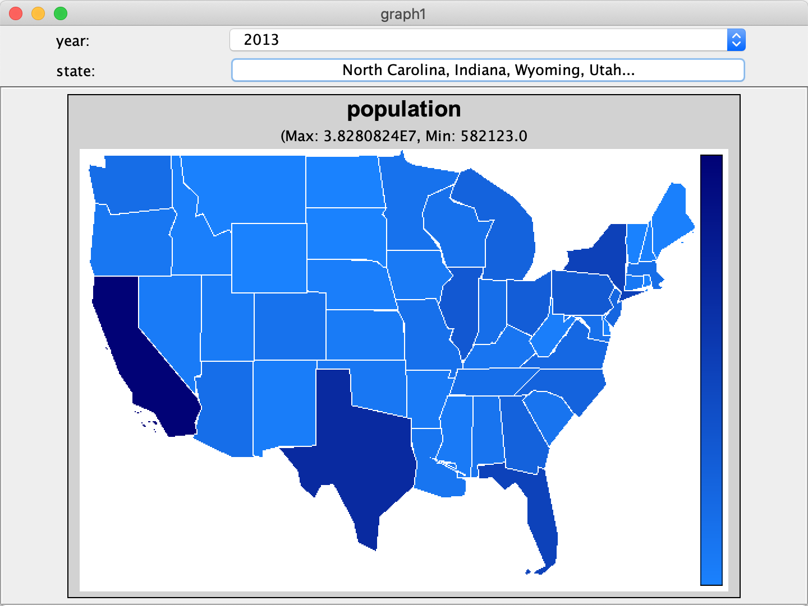
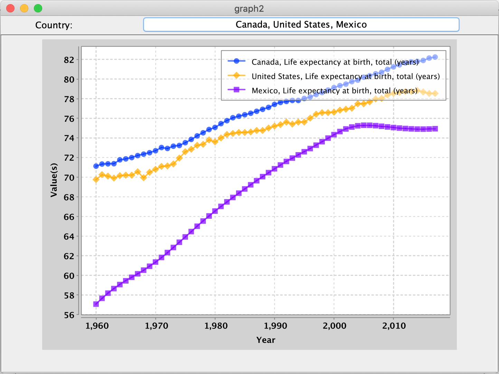
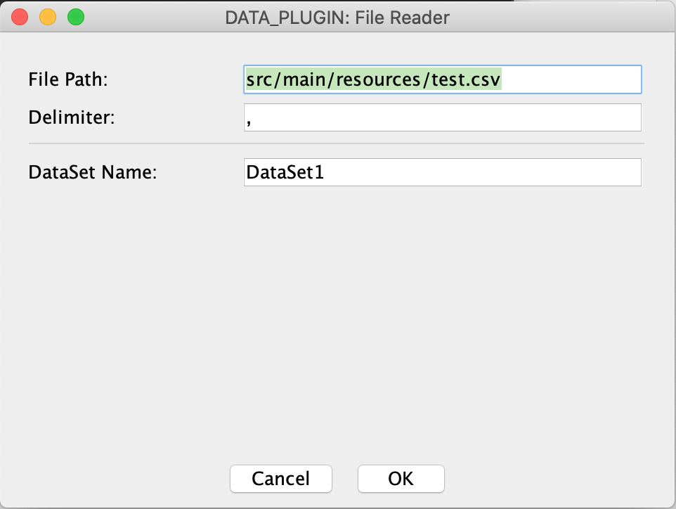
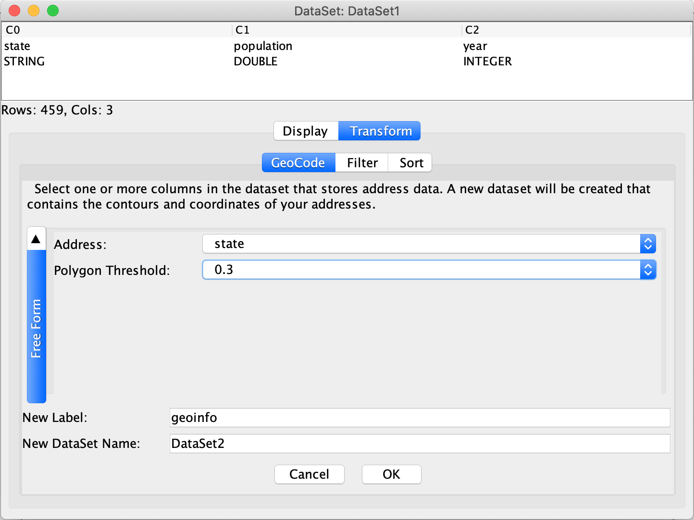
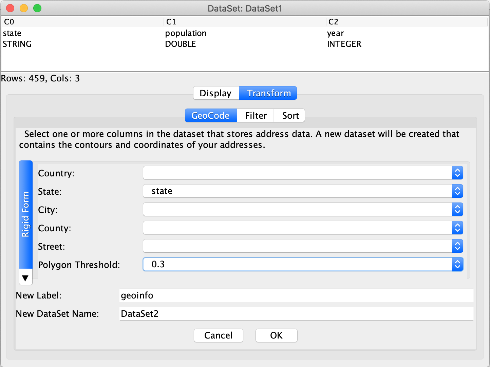
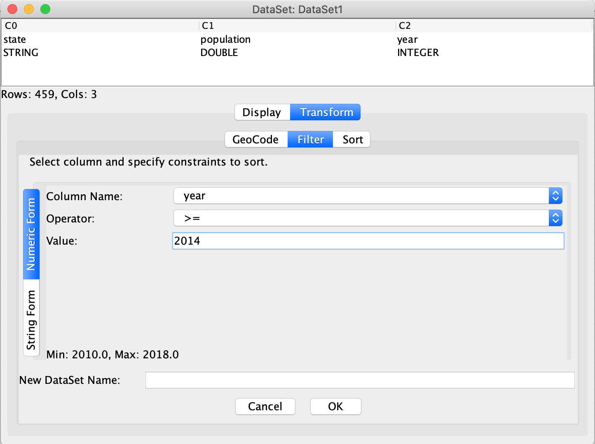
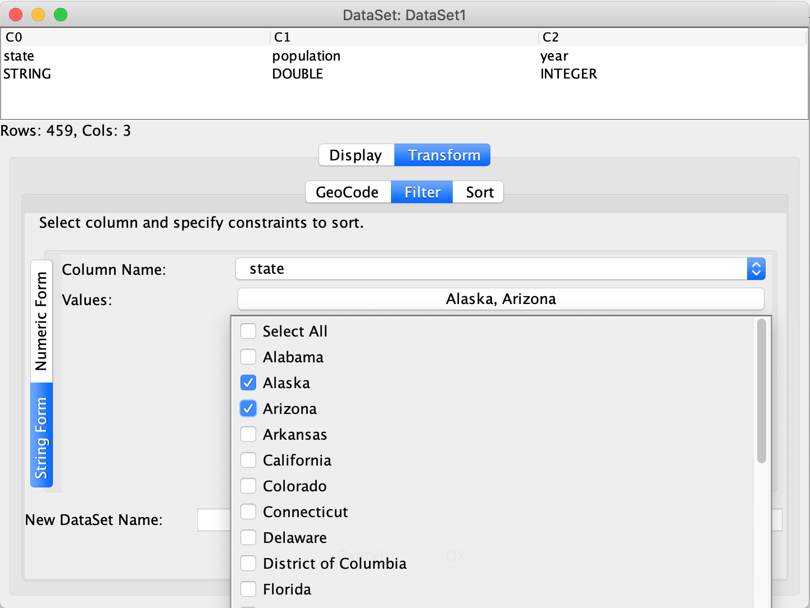
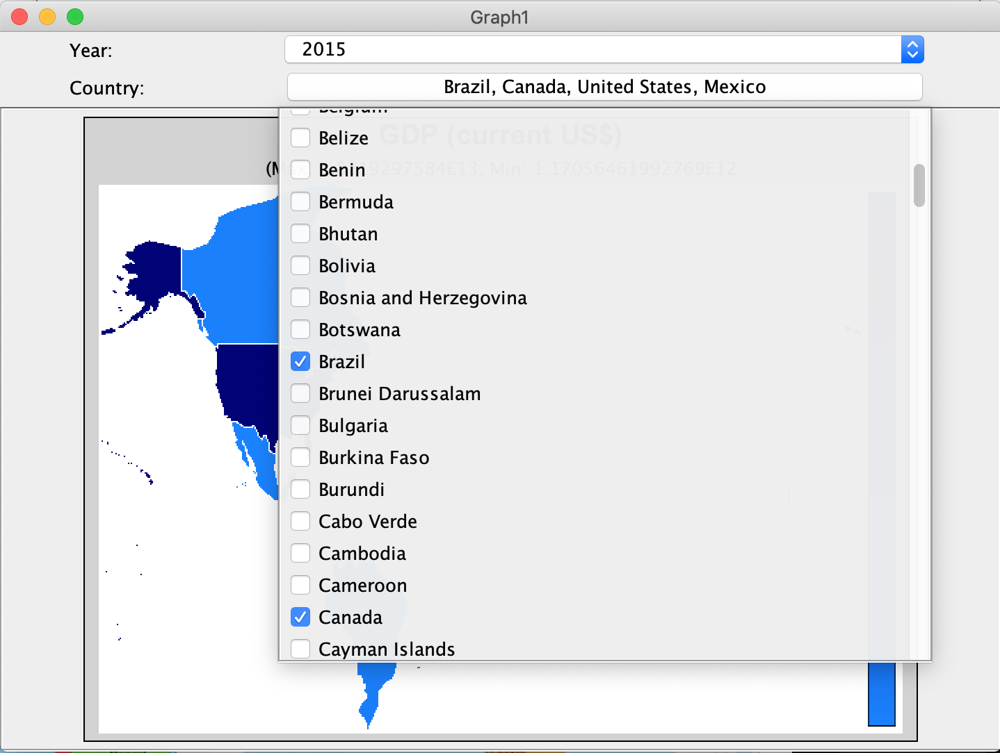

<h1 align="center">GeoData Visualization & Analysis Framework</h1>


It is not uncommon to have data associated with regions, e.g. population distribution across a country, temperature changes over different states, etc. This framework interacts with geo-data extracted from various sources, processing and visualizing it. Users can perform geocoding, filtering or sorting function on the imported dataset before visualizing it.

<h2 align="center">Example Galleries</h2>
<p align="center">
 
 
</p>

<h2 align="center">How to Run</h2>

To run our framework with our example plugins, you need to type `gradle run` in terminal at the root directory of the project.

<h2 align="center">User Guide</h2>

In this section, we will provide guide to help you navigate through the framework GUI.

### Import Data
To import data, you should click the top left `File` menu and choose any one data plugin adaptable to the data source in the “Import Data” option.

Once the plugin is selected, a window will pop up to let you specify plugin-specific configurations or information. After you providing configuration and clicking `OK`, the newly imported dataset entity will be displayed in panel. You can further display or transform the dataset by clicking the dataset entity.

<p align="center">
 
</p>

### Data Transformation

Our framework provides three kinds of transformation: `GeoCode`, `Filter` and `Sort`. To open transformation panel, you need to click on the dataset you want to transform and navigate to the `Transform` tab.

* **GeoCode**

`GeoCode` converts address representation to geo-coordinates and boundary information of a place. Applying the geocoding transformation will generate a new dataset containing `longitude`(`DOUBLE`), `latitude`(`DOUBLE`) and `contour` (`POLYGONS`) columns apart from the ones in original dataset.

In order to geocode dataset, you need to specify which column(s) is the address-relevant column(s) that will be geocoded and a new label name for newly generated columns.

Two kinds of forms are provided here. `Rigid Form` only allows rigid-format address field(s) (e.g. country, state, city, county, street), you need to provide at least one field column. `Free Form`, however, is able to take free-format addresses.

<p align="center">
  
</p>

* **Filter**

`Filter` generates a new dataset with only data entries satisfying filtering constraints in the original dataset. You need to specify which column to filter on and filtering constraints.

Similarly, two kinds of forms provided here to allow you specify filtering constraints. `Numeric Form` only filters columns of `INTEGER` or `DOUBLE` type (you will not be able to choose column of `STRING` type for filtering in this form) and requires an operator and constraint value as filtering constraints (e.g. `>= 2.0`). `String Form` let you select values in the column you specified and only the rows containing the values you selected will remain in the output dataset.

<p align="center">
  
</p>

* **Sort**

`Sort` generates a new dataset which is sorted by the column specified. In order to sort dataset, you need to specify the column by which the dataset will be sorted.

### Visualize Data

To visualize a specific dataset, you need to click on the dataset displayed in the dataset panel and a display control panel will pop up. You should choose a display plugin to display dataset.

After you select a display plugin, a bunch of plugin-specific configuration input component will pop up. For the `ChoroplethMap`  plugin we provide, you need to specify `Area Name` column that stores the area names, `Area` column that stores boundary information, `Value` column whose values will be shown by color and an optional column `Time` (a dataset might have time information or not). After clicking `OK` button, dataset will be displayed according to selected display plugin. You can also select to only show data at some timestamps and of some areas (circled as red below) in real time.

Notice that `ChoroplethMap` plugin requires `Area` field, thus is constrained to dataset containing the column of type `POLYGONS`. If dataset do not have columns storing `POLYGONS` data, you need to first use `GeoCode` functionality in `Transformation` panel to generate a column containing contour information.

<h2 align="center">Plugin Writing Guide</h2>

### DataSet, UserInputConfig & DisplayFilterConfig

Before we get into the plugins, you should first understand three classes that will be used in plugin writing: `DataSet`, `UserInputConfig` and `DisplayFilterConfig`.

* **DataSet**

`DataSet` is an immutable class that abstracts and stores the geo-dataset into the framework. It decouples the data plugins and display plugins by its abstraction. `DataPlugin` has to convert the data from the source into this class. `DisplayPlugin` will query the dataset for data visualization.

To create a `DataSet` object, you need to provide a list of column names, a list of data types (it can be `STRING`, `INTEGER` or `DOUBLE`) of each column and data entity itself as well. Data entity is represented by a `List` of rows, each row being a `List` of `Object`. Suppose we have a dataset below:

|  col1 (String) | col2(Integer) | col3(Double) |
:----:|:----:|:----:
| A | 1 | 2.9 |
| B | 2 | 4.1  |

An example code to create a `DataSet` object for this dataset will be like:
```java
List<String> labels = Arrays.asList("col1", "col2", "col3");
List<DataType> dataTypes = Arrays.asList(DataType.STRING, DataType.INTEGER, DataType.DOUBLE);

List<List<Object>> data =  new ArrayList<>();
List<Object> row1 = Arrays.asList("A", 1, 2.9);
List<Object> row2 = Arrays.asList("B", 2, 4.1);
data.add(row1);
data.add(row2);

DataSet dataSet =  new DataSet(labels, dataTypes, data);
```

* **UserInputConfig**

`UserInputConfig` tells framework to create GUI components to let users specify plugin-specific configuration or usage-specific information (e.g. file path, dataset column users are interested). Plugins can use three types defined in UserInputType to tell framework which type of component should be displayed.

`TEXT_FIELD` tells the framework to display a text field component and the choice list parameters used to create UserInputConfig will be discarded by the framework. The code below creates a text field to allow user to enter the file path.
```java
new UserInputConfig("File Path", UserInputType.TEXT_FIELD, null)
```

`SINGLE_SELECTION` tells the framework to display a drop-down list where user can only select one entry in the list. The code below creates a single selection drop-down list which has three topics.

```java
List<String> selections = Arrays.asList("GDP", "Population", "CO2 Emissions");
new UserInputConfig("Topic", UserInputType.SINGLE_SELECTION, selections);
```

`MULTISELECTION` tells the framework to display a drop-down list where user can select one or multiple entries in the list. The code below creates a multi-selection drop-down list which has three topics.
```java
List<String> selections = Arrays.asList("GDP", "Population", "CO2 Emissions");
new UserInputConfig("Topic", UserInputType.MULTI_SELECTION, selections);
```

* **DisplayFilterConfig**

`DisplayFilterConfig` is for `DisplayPlugin` to provide framework with specifications of whether and how the user can control and filter values in some certain columns to display in real time. Framework will create GUI components accordingly to allow users to control the data to be displayed.

The following image is an example of this. The user can select which year (2010, 2011, 2012… 2019) and which countries to be displayed in the graph.

<p align="center">
 
</p>

To do this, plugin only needs to provide label name and UserInputType to create a `DisplayFilterConfig` object. The following code snippets create two `DisplayFilterConfig` objects which are shown in the graph above. 

``` java
// Suppose "Year" and "Country" are labels in the dataset
new DisplayFilterConfig("Year", UserInputType.SINGLE_SELECTION);
new DisplayFilterConfig("Country", UserInputType.MULTI_SELECTION));
```

The framework will get the choice list internally by the label name specified to display in front of users, and when the framework calls `DisplayPlugin`'s `draw` method later, it will also pass in the dataset that has been filtered. This will greatly save the work of plugin.

### DataPlugin

In this section, we will use the code snippet in the example data plugin `FileReaderPlugin`, which is a simple plugin which extracts dataset from file source, to provide guide for DataPlugin writing (you can also reference for the whole code in example code we provide).

The DataPlugin interface has three APIs shown as below.

```java
public interface DataPlugin {
	String  getName();
	List<UserInputConfig>  getUserInputConfig();
	DataSet  loadData(Map<String, List<String>> params);
}
```

In order to implement this plugin, firstly, plugin should return its name back to the framework to be displayed.

Plugin could provide a `List` of `UserInputConfig` to customize the plugin-specific usage configuration or information (e.g. file path, dataset name, etc.) that user needs to specify. In this example, the plugin allows users to specify the file path and file delimiter.

```java
@Override
public List<UserInputConfig>  getUserInputConfigs() {
	List<UserInputConfig> options =  new ArrayList<>();
	// Since a text field does not need a selection list, we can set it to `null` in the according location.
	options.add(new UserInputConfig(FILE_PATH, UserInputType.TEXT_FIELD, null));	
	options.add(new UserInputConfig(DELIMITER, UserInputType.TEXT_FIELD, null));
	return options;
}
```

Once user specifies their parameter values and confirms, the plugin will be given the user’s input.

```java
@Override
public DataSet  loadData(Map<String, List<String>> params) {
	String path = params.get(FILE_PATH).get(0);
	String delimiter = params.get(DELIMITER).get(0);
```

If the plugin detects illegal input arguments, **it should throw an `IllegalArgumentException` with message** to let users know.
```java
	if (delimiter.isBlank()) {  
	    throw new IllegalArgumentException("Please specify the delimiter.");  
	}
```

If all arguments are correct, it should load the data from the file and return a `DataSet` object.
```java
	List<DataType> types = Arrays.stream(typeLine.split(delimiter))
			.map(DataType::valueOf)
			.collect(Collectors.toList());
	List<List<Object>> data =  new ArrayList<>();

	while(scanner.hasNextLine()) {
		List<Object> row =  new ArrayList<>();
		String[] valuesInLine = scanner.nextLine().split(delimiter);
		for (int i =  0; i < columnNum; i++) {
			switch (types.get(i)) {
				case STRING:	
					row.add(valuesInLine[i]);	
					break;
				case INTEGER:
					row.add(Integer.parseInt(valuesInLine[i]));
					break;
				case DOUBLE:
					row.add(Double.parseDouble(valuesInLine[i]));
					break;
				default:
					break;
			}
		}
		data.add(row);
	}
	DataSet dataSet = new DataSet(labels, dataTypes, data);
	return dataSet;
}
```

### DisplayPlugin

In this section, we will use the code snippet in the example display plugin `ChoroplethMap` to provide guide for `DisplayPlugin` writing.

`DisplayPlugin` interface has four APIs shown as below:

```java
public interface DisplayPlugin {
	String getName();
	List<UserInputConfig> getPluginConfigs(Map<DataType, List<String>> columnPreview);
	List<DisplayFilterConfig> getDisplayFilterConfig(Map<String, List<String>> pluginParams);
	JPanel draw(DataSet dataSet, int width, int height, Map<String, List<String>> pluginParams);
}
```

Similarly, plugin should provide its name to framework first and then a list of UserInputConfig to customize the plugin-specific usage configuration or information. The `columnPreview` argument passed in is a mapping from DataType to a List of labels of column of that DataType. Plugin can get a list of column labels whose column is of the required data type, which will be served as a choice list if needed.

The code snippet below notifies the framework to create four configuration components named "Area Name", "Area", "Value" and "Time". 

- "Area Name" let user choose a `STRING` column as names;
- "Area" let user choose a `POLYGONS` column as area boundaries;
- "Value" let user choose a `DOUBLE` or `INTEGER` column as displayed values;
- "Time" let user choose an `INTEGER` column as time.

```java
@Override
public List<UserInputConfig>  getPluginConfigs(Map<DataType, List<String>> preview) {
	List<UserInputConfig> configs =  new ArrayList<>();
	configs.add(new UserInputConfig("Area Name", SINGLE_SELECTION, preview.get(STRING)));
	configs.add(new UserInputConfig("Area", SINGLE_SELECTION, preview.get(POLYGONS)));
	List<String> numericLabels =  new ArrayList<>(preview.get(DOUBLE));
	numericLabels.addAll(preview.get(INTEGER));
	configs.add(new UserInputConfig("Value", SINGLE_SELECTION, numericLabels));
	configs.add(new UserInputConfig("Time", SINGLE_SELECTION, preview.get(INTEGER)));
	return configs;
}
```

(Note: the plugin can add other non-column-specific configurations if needed, such as letting user choosing the paint color.)

After the user has chosen plugin configurations, the framework will call the `DisplayPlugin` to provide a `List` of `DisplayFilterConfig` of how the user can control the displayed data. For example, if a user can only select one timestamp and but may select multiple areas to be displayed, the plugin should return as follows:

```java
@Override
public List<DisplayFilterConfig>  getDisplayFilterConfig(Map<String, List<String>> pluginParams) {
	List<DisplayFilterConfig> configs =  new ArrayList<>();
	String timeLabel = pluginParams.get("Time").get(0);
	configs.add(new DisplayFilterConfig(timeLabel, SINGLE_SELECTION));
	String nameLabel = pluginParams.get("Area Name").get(0);
	configs.add(new DisplayFilterConfig(nameLabel, UserInputType.MULTI_SELECTION));
	return configs;
}
```
If the plugin needs framework to sort on a label, it could add sort argument in `DisplayFilterConfig`.
```java
	String valueLabel = pluginParams.get("Value").get(0);
	// UserInputType.NONE tells framework not to filter on this column,
	// true/false tells framework to sort on this column in ascending/descending order.
	configs.add(new DisplayFilterConfig(valueLabel, UserInputType.NONE, false));
```
(Note: If the plugin does not need framework to do the filtering or sorting job, it could return `null` or an empty list.)

<h2 align="center">Adding New Plugins</h2>

After writing the data plugins or display plugins, you can add your own plugins into our framework. 
Firstly, you should provide full class names of new plugins in the following files of your module.

```
src/main/resources/META-INF/services/edu.cmu.cs.cs214.hw5.core.DataPlugin
src/main/resources/META-INF/services/edu.cmu.cs.cs214.hw5.core.DisplayPlugin
```

Then, you should make your `build.gralde` file like this:

```java
apply plugin: 'java'
apply plugin: 'maven'
apply plugin: 'application'

repositories {
	mavenCentral()
}

dependencies {
	compile project(':framework')
}

mainClassName =  'edu.cmu.cs.cs214.hw5.Main'
```

In the `settings.gradle` file, you need to include our project and specify the path.

```java
include ':framework'
project(':framework').projectDir = file('../framework')
```

Once dependency is added, you can simply run the framework by typing in the terminal:
```bash
$ gradle run
```

<h2 align="center">Author</h2>

- Guoqiang Zeng (guoqianz@andrew.cmu.edu)

- Jiajun Zhu (jiajunzh@andrew.cmu.edu)

<h2 align="center">Credits</h2>

- <a href="https://nominatim.openstreetmap.org"> Nominatim</a>, a search engine for <a href="https://www.openstreetmap.org/"> OpenStreetMap</a> data.

- <a href="https://knowm.org/open-source/xchart/">xChart</a>
